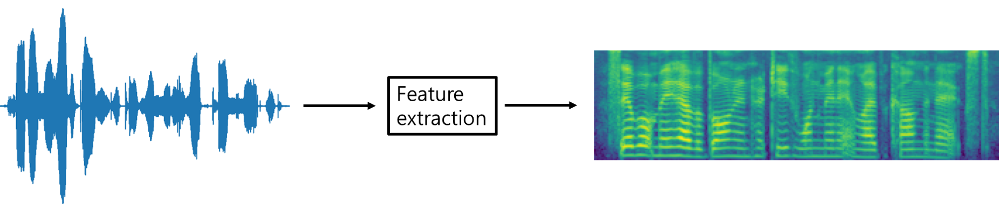

# Speech enhancement

## Developers
* Younglo Lee (yllee@ispl.korea.ac.kr)

## Contents
  * [Contents](#contents)
  * [Acoustic feature extraction](#acousticfeatureextraction)
  * [References](#references)
    
## Acoustic feature extraction
Python implementation of log-mel spectrogram extraction [1]

## References
[1] https://github.com/Rayhane-mamah/Tacotron-2