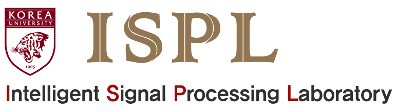

# Intelligent signal processing laboratory @ korea university

<\tcenter>

## Members
* Younglo Lee (yllee@ispl.korea.ac.kr)
* Byeonghak Kim (bhkim@ispl.korea.ac.kr)
* Donghyeon Kim (dhkim_2@ispl.korea.ac.kr)
* Jeongki Min (jkmin@ispl.korea.ac.kr)
* Gwantae Kim (gtkim@ispl.korea.ac.kr)

## Contents
  * [Contents](#contents)
  * [Acoustic feature extraction](#feature)
  * [Speech enhancement](#speechenhancement)
  * [Speech synthesis](#speechsynthesis)
    * [Training times](#training-times)
    * [Evaluation results](#evaluation-results)
