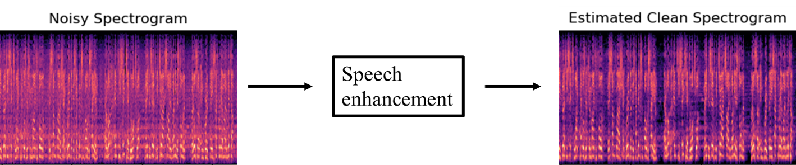

# Speech enhancement

## Developers
* Younglo Lee (yllee@ispl.korea.ac.kr)
* Gwantae Kim (gtkim@ispl.korea.ac.kr)

## Contents
  * [Contents](#contents)
  * [Spectral subtracion](#spectralsubtraction)
  * [MMSE estimator](#mmseestimator)
  * [Subspace method](#subspacemethod)
  * [References](#references)
    
## Spectral subtraction
Python implementation of spectral subtraction [1]

## MMSE estimator
Python implementation of minimum mean squared error estimator [1]

## Subspace method
Python implementation of SVD-based subspace algorithm [1]

## References
[1] Loizou, Philipos C. Speech enhancement: theory and practice. CRC press, 2007.
