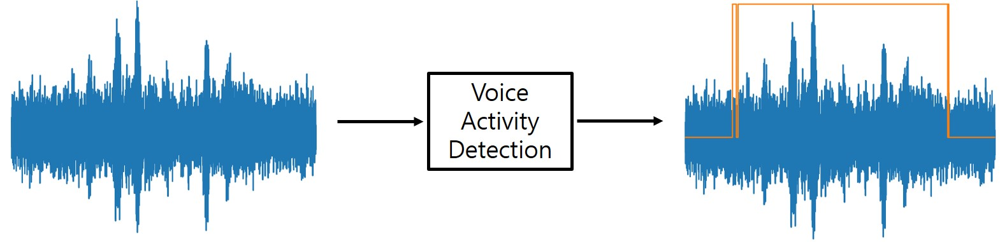

# Voice Activity Detection

## Developers
* Younglo Lee (yllee@ispl.korea.ac.kr)

## Contents
  * [Contents](#contents)
  * [Voice Activity Detection](#voiceactivitydetection)
  * [Prerequisites](#prerequisites)
  * [References](#references)
    
## Voice Activity Detection
Tensorflow implementation for voice activity detection in tensorflow:
Younglo Lee, Jeongki Min, David Han, Hanseok Ko, "Spectro-Temporal Attention-Based Voice Activity Detection," IEEE Signal Processing Letters, Vol. 27, Issue 1, pp. 131-135
URL: https://ieeexplore.ieee.org/document/8933025

## Prerequisites
- Python 3.x
- Tensorflow 1.15.0

## References and Resources
- https://github.com/Rayhane-mamah/Tacotron-2
- https://github.com/jtkim-kaist/VAD
